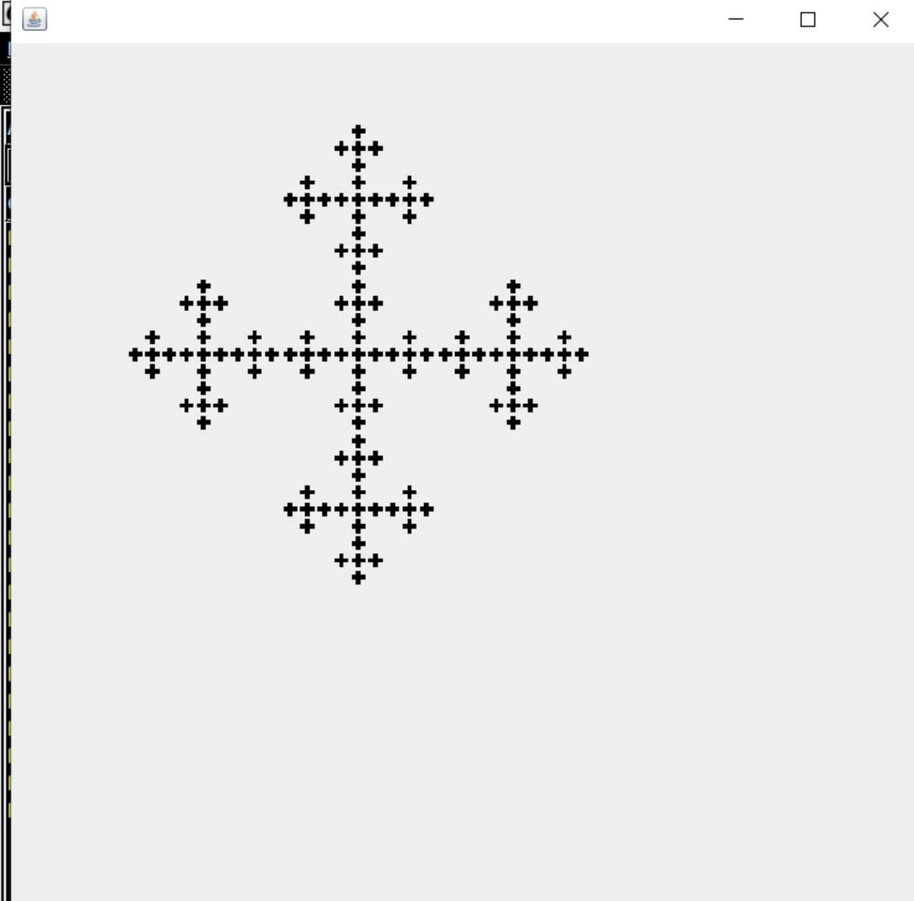

<h1>Clase Fractal de Vicsek</h1>

<h2>Mecánica del Fractal</h2>
Se realiza un programa en java swing para hacer un fractal, utilizamos recursividad que depende de la profundidad del fractal, en el que el caso base es cuando la profundidad es igual a 1.
El programa soporta una profundidad de entre 1 y 5, ya que, en cada iteración se va dividiendo la pantalla entre 3.  
<h2>Funciones Extras</h2>
Al programa se le agrega un timer (usando javax.swing.timer) en el cual podemos ir viendo la evolucion con las distintas profundidas que pueda tener el fractal, además que presionando la tecla del espacio, 
usando el evento key listener, podemos pausar el timer y volviendo a presionar la tecla del espacio podemos volver a hacer que el timer continue
